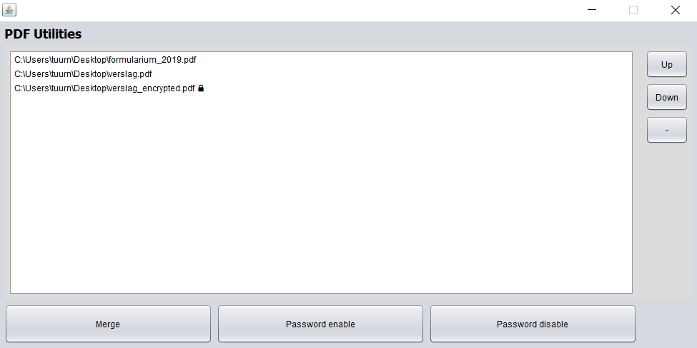

# PdfUtil
A java application that combines pdf tools using an intuitive drag-and-drop interface.

## NOTE
The project was migrated from the NetBeans IDE to the IntelliJ IDE.
Gradle (with the Kotlin DSL) is used as build manager.

## Current features
 - Merging
 - Splitting (experimental)
 - Show pdf information (number of pages, size, author, creator, title, subject)
 - Password protection and password stripping



## Future features
- Image extraction
- Text extraction
- Watermarking

## Used libraries
- Apache PDFBox 2.0.16 & preflight 2.0.16 (https://pdfbox.apache.org)
- FileDrop (http://iharder.sourceforge.net/current/java/filedrop/)


##Releases
Releases can be found at http://neckebroecktuur.ulyssis.org/pdfutil/releases

## Usage
Example for release 2.0:
```
java -jar PdfUtil-2.0-SNAPSHOT.jar
```
